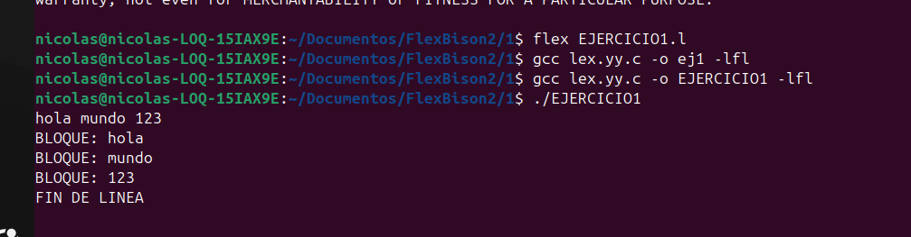
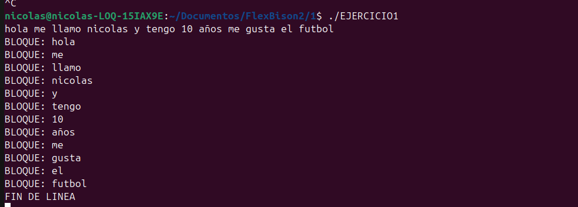
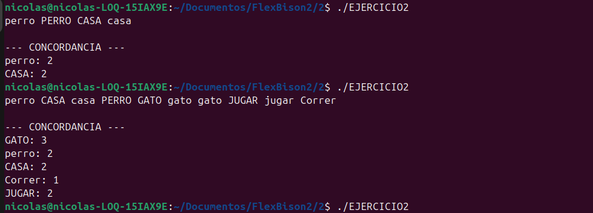
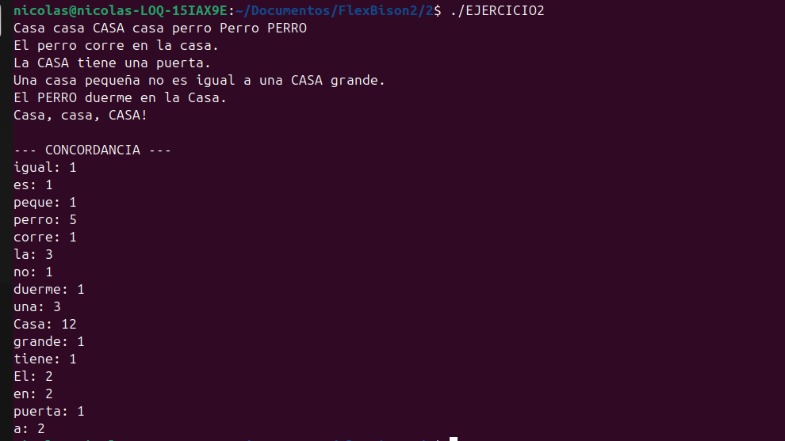
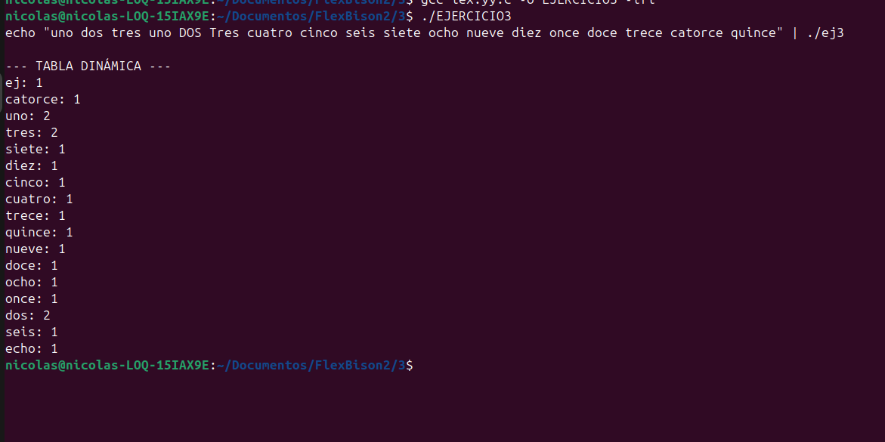

# FLEX-AND-BISON-CAPITULO-3

**INTRODUCCION**

Este proyecto corresponde a la implementación de los ejercicios del Capítulo 2 del libro Flex & Bison, enfocado en el uso de Flex para la construcción de analizadores léxicos mediante expresiones regulares. El objetivo principal es comprender cómo funciona el proceso de reconocimiento de patrones en texto y cómo se pueden aplicar estructuras de datos en C dentro de un scanner generado por Flex. A lo largo de los ejercicios se desarrollan tres programas: el primero reconoce bloques de texto en lugar de procesar carácter por carácter, el segundo implementa una concordancia de palabras sin distinguir entre mayúsculas y minúsculas utilizando funciones como tolower() y strcasecmp(), y el tercero mejora la tabla de símbolos haciéndola dinámica mediante el uso de tablas hash con listas enlazadas (chaining), evitando así las limitaciones de tamaño fijo. Estos ejercicios permiten reforzar conceptos fundamentales de análisis léxico, manejo de memoria dinámica y estructuras de datos aplicadas al diseño de compiladores.

**REQUISITOS PARA LA EJECUCION**

Paquetes:

-flex

     gcc / build-essential

-Instalación:

    sudo apt update

    sudo apt install -y flex gcc build-essential

-Verificación:

    flex --version

    gcc --version

**COMO EJECUTAR**

Para cada ejercicio (ejemplo EJERCICIO1):

Paso 1: Entrar a la carpeta del ejercicio (si tienes carpetas separadas)

Paso 2: Generar C con Flex:

    flex EJERCICIO1.l

Paso 3: Compilar el C generado:

    gcc lex.yy.c -o ej1 -lfl

Paso 4: Ejecutar

    ./ej1

Para probar rápido sin escribir manual:

Con echo:

echo "texto de prueba" | ./ej2

Con archivo:

./ej2 < input.txt

Importante: si lo ejecutas “a mano” (./ej2) el programa queda esperando entrada; termina con CTRL + D (EOF). Si quieres cancelar: CTRL + C.

**DESCRIPCION**

Ejercicio 1

En el primer ejercicio se desarrolla un analizador léxico que reconoce bloques de texto completos en lugar de procesar la entrada carácter por carácter. Para lograrlo, se utilizan expresiones regulares que capturan secuencias de caracteres distintos de espacios, tabulaciones y saltos de línea, permitiendo identificar palabras o bloques significativos dentro del texto. Este enfoque mejora la eficiencia del reconocimiento y demuestra cómo Flex aplica la regla del “longest match” al momento de seleccionar qué patrón ejecutar. Además, se manejan adecuadamente los espacios y los saltos de línea para separar correctamente los bloques, evidenciando la importancia del orden de las reglas dentro del archivo .l.

Ejercicio 2

El segundo ejercicio implementa un programa de concordancia que cuenta la frecuencia de aparición de palabras en un texto sin distinguir entre mayúsculas y minúsculas. Para ello, se modifica la función de hash utilizando tolower() con el fin de normalizar los caracteres antes de calcular su posición en la tabla, y se emplea strcasecmp() para comparar cadenas de forma case-insensitive. De esta manera, palabras como “Casa”, “CASA” y “casa” se consideran equivalentes y se contabilizan como una sola entrada. Este ejercicio refuerza el uso de estructuras como tablas hash y listas enlazadas dentro de un scanner generado por Flex, integrando lógica en C para el manejo de datos dinámicos.

Ejercicio 3

En el tercer ejercicio se mejora la implementación de la tabla de símbolos eliminando la limitación de tamaño fijo que podía provocar fallos cuando la estructura se llenaba. Se implementa el método de chaining, en el cual cada posición de la tabla hash apunta a una lista enlazada de símbolos, permitiendo almacenar un número indefinido de palabras sin necesidad de redimensionar la tabla completa. Esta solución resulta más simple y estable para aplicaciones como la concordancia o el cross-reference, ya que evita mover elementos existentes como ocurriría en un proceso de rehashing. Con ello se demuestra una aplicación práctica de estructuras dinámicas en C dentro del contexto del análisis léxico.

**PRUEBAS Y RESULTADOS**

Ejercicio 1

Para el primer ejercicio realicé pruebas ingresando diferentes líneas de texto con palabras, números y espacios. El programa identificó correctamente los bloques definidos por la expresión regular y separó adecuadamente cada palabra según lo esperado. También se verificó que los saltos de línea fueran reconocidos correctamente y que no aparecieran advertencias durante la ejecución. En general, el comportamiento fue consistente con lo diseñado y permitió comprobar que el reconocimiento de bloques funciona de manera adecuada.

Ejercicio 2

En el segundo ejercicio probé textos con distintas combinaciones de mayúsculas y minúsculas, por ejemplo palabras como “Casa”, “CASA” y “casa” dentro del mismo contenido. Los resultados demostraron que el programa las contabiliza como una sola palabra, lo cual confirma que el uso de tolower() y strcasecmp() fue implementado correctamente. Los conteos obtenidos coincidieron con el número real de apariciones, mostrando que la concordancia funciona de forma correcta y sin duplicaciones innecesarias.

Ejercicio 3

Para el tercer ejercicio ingresé textos más extensos con una mayor variedad de palabras para evaluar el comportamiento de la tabla hash dinámica. El programa manejó correctamente las colisiones mediante el uso de listas enlazadas (chaining), sin presentar errores relacionados con el tamaño de la estructura. Esto permitió comprobar que la implementación es estable y escalable, incluso cuando aumenta la cantidad de datos procesados.

**ANALISIS**

La implementación de los ejercicios del Capítulo 2 permitió analizar de manera detallada el funcionamiento interno de un analizador léxico generado con Flex, comprendiendo cómo las expresiones regulares se transforman en autómatas finitos deterministas para el reconocimiento eficiente de patrones en un flujo de entrada. Se evidenció que Flex aplica el principio de coincidencia más larga (longest match) y prioriza las reglas según su orden de aparición, lo que obliga a diseñar cuidadosamente las expresiones regulares para evitar ambigüedades o reglas inalcanzables. Asimismo, la integración de código en C dentro de las acciones del scanner demostró que el análisis léxico no se limita a la identificación de tokens, sino que puede incluir procesamiento adicional mediante estructuras de datos dinámicas. En particular, la implementación de una tabla hash con encadenamiento (chaining) permitió eliminar la restricción de tamaño fijo y manejar colisiones de forma eficiente mediante listas enlazadas, mejorando la escalabilidad y robustez del sistema. En conjunto, estos ejercicios consolidan la comprensión de conceptos fundamentales como análisis léxico, eficiencia computacional, manejo de memoria dinámica y diseño estructurado de herramientas para el procesamiento de lenguajes formales.

**CONCLUSIONES**

La implementación de estos ejercicios permitió comprender de manera práctica el funcionamiento del análisis léxico utilizando Flex y expresiones regulares. Se evidenció la importancia del orden de las reglas y del principio de coincidencia más larga en el reconocimiento de patrones dentro del texto.

Además, la integración de estructuras de datos dinámicas como tablas hash con encadenamiento permitió eliminar limitaciones de tamaño fijo y mejorar la eficiencia y escalabilidad del programa. En conjunto, estos ejercicios fortalecieron conceptos fundamentales del diseño de compiladores y del procesamiento estructurado de información.
